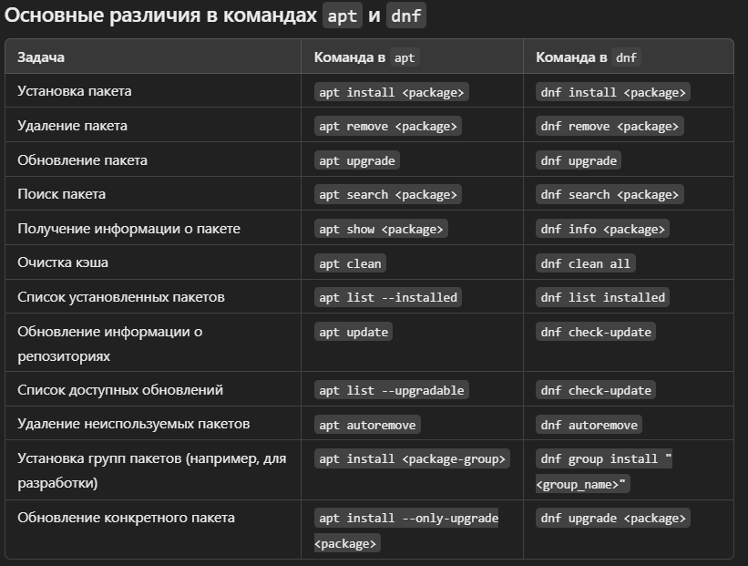

## Оглавление
1. [Настройка сервера](#настройка-сервера)
2. [Пакетный менеджер](#пакетный-менеджер)
3. [Сеть](#сеть)
4. [База](#база)
5. [Система](#система)
6. [Разное](#разное)
7. [Диски](#диски)
### Настройка сервера
- `groups username` - группы пользователя

- `sudo addgroup groupname` - добавить группу

- `sudo adduser username` - добавить пользователя 

- `sudo usermod -aG groupname username` - для добавления пользователя в группу без удаления его из других групп

- `su -`:  если добавить - (или --login), это переключит вас на пользователя root и загрузит окружение, как если бы вы вошли в систему как root. Это означает, что все переменные окружения будут инициализированы для пользователя root, и вы будете находиться в домашнем каталоге root.
- `lsb_release -a` или `hostnamectl` - версия ОС

### Пакетный менеджер (apt)
- `apt remove --purge` или `sudo apt purge` - удаляет как сам пакет, так и все связанные с ним конфигурационные файлы
- `sudo apt autoremove` - используется для удаления пакетов, которые были автоматически установлены в качестве зависимостей для других пакетов, но больше не нужны
- `sudo apt update` - система скачивает список пакетов и их версий с серверов репозиториев, но **не устанавливает и не обновляет пакеты**.
- `sudo apt upgrade` - обновляет все установленные пакеты до последних доступных версий, основываясь на информации, полученной с помощью `apt update`, однако эта команда не устанавливает новые пакеты или не удаляет старые. Если для обновления пакета требуются новые зависимости, они не будут установлены.
- `sudo apt full-upgrade` - не только обновляет пакеты, но и может устанавливать новые зависимости и удалять старые пакеты, если это необходимо для завершения обновления
- `sudp apt install` - устанавливает пакет
- `supo apt search ` - поиск пакета по имени
- `sudo apt show` - инфо о пакете
- `sudo apt autoclean` - для удаления старых неиспользуемых файлов
- `sudo apt clean` - APT хранит загруженные .deb файлы в кэше на диске, чтобы очистить этот кэш. Эта команда удаляет все файлы в dir `/var/cache/apt/archives/`
- `/etc/apt/sources.list` - основной файл, где перечислены все репозитории. Этот файл указывает, откуда APT будет загружать пакеты.
- `/etc/apt/sources.list.d/` - в этот каталог можно добавлять дополнительные файлы для подключения новых репозиториев.
> Есть ещё `apt-get`, но это более старая команда, которая в основном используется для скриптов, потому что не предусматривает интерактивную работу с системой

APT работает поверх более низкоуровневого инструмента `dpkg`, который непосредственно устанавливает .deb пакеты. 
- `sudo dpkg -i package_name.deb` - для установки `.deb` пакета
- `sudo apt --fix-broken install` - если возникли проблемы с зависимостями

--- 

- `rpm -ivh <package_name>.rpm` - установка rpm пакета
- `rpm -e <package_name>.rpm` - удаления пакета
- `rpm -Uvh <package_name>.rpm` - обновление пакета, если он не установленЮ он установится
- `rpm -qi <package_name>` - просмотр информации о пакете
- `rpm -V <package_name>` - проверка целостности пакета
- `rpm -ql <package_name>` - список файлов в пакете
- `dnf install <package_name>.rpm` - установка rpm пакета через dnf, dnf будет управлять зависимостями

- `dnf install https://example.com/package-file.rpm` - установка rpm пакета напрямую из ссылки



### Сеть
- `cat /etc/ssh/sshd_config | grep Port` - показывает на каком порту открыт ssh
- `ss -tulpn` - информация о текущих сетевых соединениях и портах
- `curl ifconfig.me` - узнать публичный ip машины
- `iptables -L` - правила файрвола
    - `iptables -L -v` - подробный вывод
    - `iptables -L --line-numbers`
    - `iptables -L -t nat` - позволяет указать конкретную таблицу для просмотра. Например, для просмотра правил NAT
- `iperf3` - для измерения скорости передачи данных между серверами 
- `speedtest-cli` - спидтест
    - `speedtest-cli --list` - список серверов
    - `speedtest-cli --server SERVER_ID`
- `fuser 9095/tcp` - проверить доступность порта 
- `ethtool enp0s3` - диагностика сетевого интерфейса на физическом уровне (`ethtool enp0s3` - статистика)
- `arp -a` - arp таблица (ip -> mac)
- `ip route` - таблица маршрутизации (можно проверить есть ли шлюз)
- `resolvectl status` - инфо о днс
- `cat /etc/resolv.conf` - инфо о днс
- `ip -4 route get 8.8.8.8`


### База
- `cp -p` - сохранить атрибуты файлов (время создания, права, владельца)
- `cp -v` - выводить информацию о каждом копируемом файле
- `mv -v` - подробный вывод при перемещении.
- `chmod 644 /etc/passwd` - изменение прав доступа к файлам и директориям
- `chown root:root /etc/hosts` - изменение владельца и группы
- `ps -aux` - выводит список всех процессов с информацией о пользователях, загрузке, времени и командах
- `ps -ef` - полная информация о процессах с идентификаторами владельцев
- `top -o %CPU` - сортировка процессов по указанному полю (например, по CPU)
    - `shift + v` в top - процессы в древовидной структуре с отображением дочерних процессов
    - `1` - нагрузка на поток (логическое ядро)
- `kill -9 1234` - принудительное завершене процесса (1234 — PID процесса)
- `df -h` - информация о файловых системах 
- `df -i` - иноды
- `du` - отображение размера файлов и каталогов
    - `-s` - отображает только итоговый размер
    - `--max-depth=1` - выводит размер каталога и его подкаталогов
- `du -sh /tml` - размер директории
- `ifconfig` - информация о сетевых интерфейсах
- `ss -tulpn` - информация о сетевых соединениях
- `ping` - проверка доступности хоста 
- `traceroute` - через какие маршрутизаторы проходит пакет до хоста 
- `nslookup` - информация о DNS-сервере

- `sudo useradd -m username` - добавление нового пользователя (`-m` - создание домашнего каталога)
- `sudo passwd username` -  установка или изменение пароля пользователя
- `sudo usermod -aG sudo username` - добавить пользователя в группу `sudo`
- `sudo groupadd developers` - создание новой группы
- `tail -f /var/log/*` - логи (`-f` - обновление в реальном времени)
- `journalctl` - утилита для просмотра логов служб, управляемых `systemd`
    - `-u <service_name>` - просмотр логов конкретной службы
    ```bash
    journalctl -u nginx
    ```
    - `journalctl -u nginx -f` - просмотр логов в реальном времени
    - `journalctl -n 100` - последние 100 строк
    - `journalctl --since "2024-10-03 12:00:00" --until "2024-10-03 14:00:00"` - логи за конкретный период
    - `journalctl -p err` - можно показывать только ошибки
        - emerg (0): Аварийные сообщения.
        - alert (1): Требуют немедленных действий.
        - crit (2): Критические ошибки.
        - err (3): Ошибки.
        - warning (4): Предупреждения.
        - notice (5): Важные события.
        - info (6): Информационные сообщения.
        - debug (7): Отладочные сообщения.
    - `journalctl -xe` 
        - x (или --catalog) — выводит дополнительные объяснения (аннотации) к некоторым сообщениям журнала. Это помогает понять детали ошибок или предупреждений, предлагая описания и возможные решения, если такие есть.
        - e (или --pager-end) — открывает журнал в режиме постраничного просмотра и сразу прокручивает его до конца, показывая самые последние записи.
  
- `smartctl -a /dev/sda` - смарт отчет диска, генерит сам диск 
- `free -m` - оперативная память 
- `cat /proc/meminfo` - подробно про память
- `cat /proc/cpuinfo` - подробно про проц
- `traceroute` - путь пакетов от сервера к серверу (промежуточные маршрутизаторы) (`mtr` покажет путь в лайве)
- `nslookup`, `dig @<dns-server> <dns-name>` - инфа о DNS сервере

- `curl -Lv domain.ru` - получить html страницу
- `curl -v telnet://127.0.0.1:22` - доступность порта 
- `tcpdump -i any port 9100 -nn` - пакеты через этот порт 
- `tar` - работа с архивами 
    - `-cvf` - создать архив
    - `-xvf` - извлечь архив
    - `-z` - использовать сжатие `gzip`
    ```bash
    tar -xvfz backup.tar.gz /var/www
    ```
- `sudo tar -zxvf apache-activemq-6.1.3-bin.tar.gz -C /opt` - распаковать в каталог
- `tar xvf apache-tomcat-9.0*tar.gz -C /opt/_Tomcat/application1-8080 --strip-components=1` - каталог apache-tomcat-9.0* не будет создан
- `dmesg -T` - логи ядра системы 

### Система

- `lsof` - Команда lsof (List Open Files) в Linux используется для отображения списка открытых файлов в системе. В Linux (и Unix-подобных системах) практически все является файлом, включая сетевые соединения и устройства. 
    - `lsof` - просмотр всех открытых файлов
    - `lsof -u username` - файлы открытые конкретным пользователем 
    - `lsof -p 1234` - поиска файлов открытых определённым процессом 
    - `lsof -i :80` - соединения по конкретному порту 
    - `lsof /dev/sda1` - файлы использующие определённое устройство или файловую систему
    -  `lsof | grep filename` - Если файл заблокирован и его нельзя удалить или переместить, `lsof` покажет, какой процесс его использует
- `strace` - системные вызовы

- `killall -s 9 <hello>` - убивает все процессы в названием hello (`-s` - тип сигнала) 
- `w` - залогиненые пользователи и время `uptime`
- `whoami` - имя залогиненного пользователя
- `uptime` - сколько работает система без перезагрузки 
    - `-s` - время запуска
    - `-p` - время работы системы

- `less -S` - не переносит на новую строку
- `sudo reboot now` - перезагрузка системы
- `sudo shutdown now` - выключить компьютер
- `watch "some command"` - переодически запускает команду

- `lscpu` - информация о процессоре
- `lspci` - информация об устройствах подключенных к pci шине
- `lsusb`

- `/var/log/dmesg` - логи загрузки системы
- `pstree` - дерево процессов
- `/usr/lib/systemd` - директория с юнитами по умолчанию
- `ps aux --sort=-%mem | head -n 10`
### Разное

- `alt .` - перебирает последние аргументы из истории команд (`history`), если аргументов нет, то перебирает сами команды  
- `ctrl R` - поиск команд из `history`
- `    !!    `
- `ctrl A` - перемещение курсора в начало
- `ctrl E` - перемещение курсора в конец
- `ctrl U` - вырезает всё, что СЛЕВА от курсора (`ctrl Y` - вставить)
- `ctrl W` - выразает 1 слова, СЛЕВА от курсора (`ctrl Y` - вставить)
- `ctrl K` - вырезает всё, что СПРАВА от курсора (`ctrl Y` - вставить)
- `cd -` перейти в предыдущую директорию
- `^restart^status` - замена с ... на ... в последней выполненной команде 
- `&` - в конце команды и команды будет выполняться в фоновом режиме
- `nohup <command> &` - если закроем терминал команда продолжит выполняться
- `nl` - как `cat`, но еще выводит номера строк
- `ctrl L` - `clear`
- `reset` - используется для сброса настроек терминала и очистки экрана
--- 
- `cd` - вернуться в домашнюю директорию
- `touch file{4..13}`
- `mkdir dir_{a..f}`
- `cp -iv file1 dir1/file2` - (`-i`) спрашиваем будем ли перезаписывать 
- `cp -nv` - не перезаписывать 
- `stat file`
    - Размер файла (Size): В байтах.
    - Тип файла: Обычный файл, каталог и т. д.
    - Права доступа (Access): Права на чтение, запись и выполнение для владельца, группы и других пользователей.
    - Идентификаторы пользователя и группы (UID/GID): Идентификатор владельца и группы.
    - Время изменения (Modify): Дата и время последнего изменения содержимого файла.
    - Время последнего доступа (Access): Когда файл был последний раз открыт.
    - Время изменения метаданных (Change): Когда были изменены права или метаданные файла.
    - Номер inode: Уникальный номер файла в файловой системе.
--- 

- `kill -l` - список возможных сигналов

- `cp -a source_file destination_directory/` - Опция `-a` эквивалентна комбинации нескольких опций: `-d` (сохраняет символические ссылки), `-p` (сохраняет права доступа, владельца и временные метки), и `-r` (рекурсивно копирует каталоги).
- `cp -vu` - пропустить совпадающие файлы, а скопировать только файлы новее или отсутствующие
---
`/etc/passwd` - инфо о пользователях в системе


### Диски 
- `sudo fdisk -l` 
    - Показывает список всех подключенных устройств (жестких дисков, SSD и т.д.).
    - Отображает размер дисков, типы разделов, точки монтирования.
    - Полезно для диагностики, перед созданием или изменением разделов.
- `lsblk` - показывает дерево всех подключенных устройств, их разделы, точки монтирования. (`-f` - для более детальной информации о файловых системах, `-p` - полные пути к устройствам, `-d` - показывает только диски, без разделов, `-J` - результат в виде json)
- `sudo cfdisk <устройство>` - команда для работы с разделами диска 


- `sudo mkfs.<тип файловой системы> <устройство>` - команда в Linux для создания файловой системы на разделе диска. Она форматирует указанный раздел с выбранной файловой системой.
- `/etc/fstab` - это файл конфигурации в Linux, который содержит информацию о том, какие файловые системы должны автоматически монтироваться при загрузке системы.


Каждая строка в `/etc/fstab` описывает один файловый раздел и содержит следующие поля:

- Файл устройства (например, /dev/sda1 или UUID диска).
- Точка монтирования (например, /, /home, /mnt/data).
- Тип файловой системы (например, ext4, ntfs, swap).
- Опции монтирования (например, defaults, noatime, ro).
- Параметр для dump (обычно 0, определяет необходимость резервного копирования).
- Параметр для проверки на ошибки (fsck) (0 — не проверять, 1 — проверять при загрузке).

Пример строки
```
UUID=3b14dabe-6a1a-4a1b-9e41-3d9b26b6ef1f / ext4 defaults 0 1
```
- `sudo blkid` - выводит информацию о всех блочных устройствах, включая UUID
- `mount` - используется для подключения файловых систем (например, жестких дисков, флешек) к определенным точкам монтирования в файловой системе
```
mount [OPTIONS] <DEVICE> <MOUNTPOINT>
```

- `sudo mount /dev/sda1 /mnt` - это монтирует раздел /dev/sda1 в директорию /mnt
- `sudo mount -t ext4 /dev/sda1 /mnt` - подключить с указанием типа файловой системы

---
- `df -Th` - информация о файловых системах и их типах 
- `du -sh *` - размеры файлов и директорий в текущей
- `lsblk -d -o name,rota` 
    - 1 это HDD (жесткий диск).
    - 0 это SSD (твердотельный накопитель)
> диск с названием sr* это cd привод

- `lsscsi` - отображает устройства, подключенные через интерфейс SCSI
- `cp /etc/fstab{,.bkp}` == `cp /etc/fstab /etc/fstab.bkp`


- `grep -A 10 <файл>` - вывести 10 строк после найденного файла
- `htop -p ` - процесс на таком-то порту 
- `truncate -s 0 /var/log/messages`

- `sudo find / -name pg_config 2>/dev/null`
